# Website Berita | Ujian Tengah Semester & Ujian Akhir Semester

## Mata Kuliah Pemrograman Web Lanjut

 

## Fitur-Fitur:

-   Login
-   Register
-   Kategori Berita
-   Berita Terbaru
-   Tambah Kategori Berita
-   Edit Kategori Berita
-   Hapus Kategori Berita
-   Tambah Post
-   Edit Post
-   Hapus Post
-   Logout

## Roles:

-   Admin
-   Pengelola

# Preview Tampilan Website:

## Login

   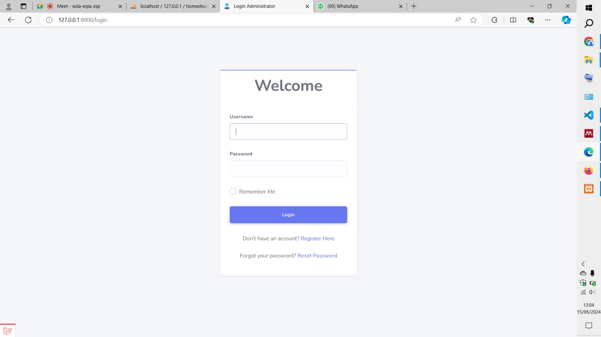
   
## Register
  
   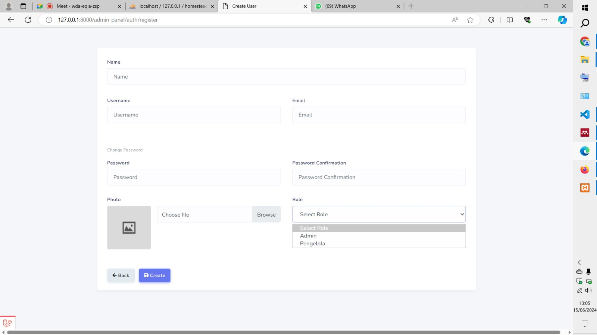
   
## Tampilan Berita
  
  - Tampilan 1
    
     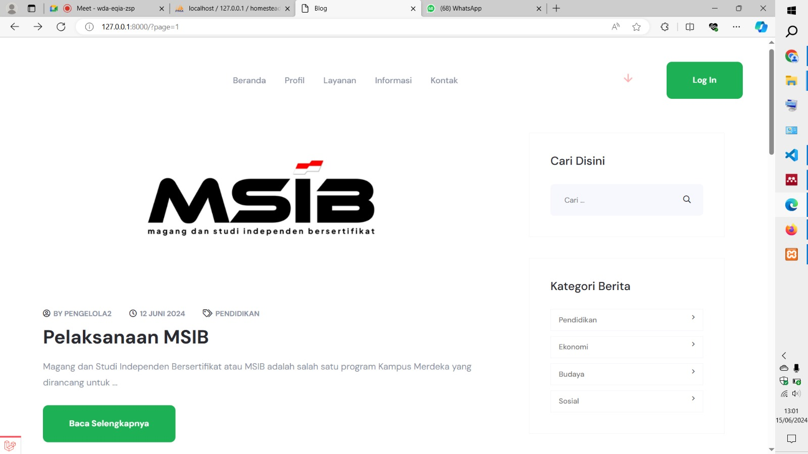
     
  - Tampilan 2
    
     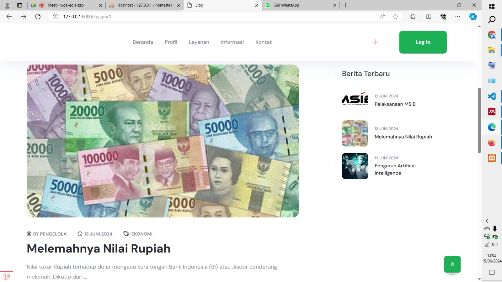
     
  - Tampilan 3
    
     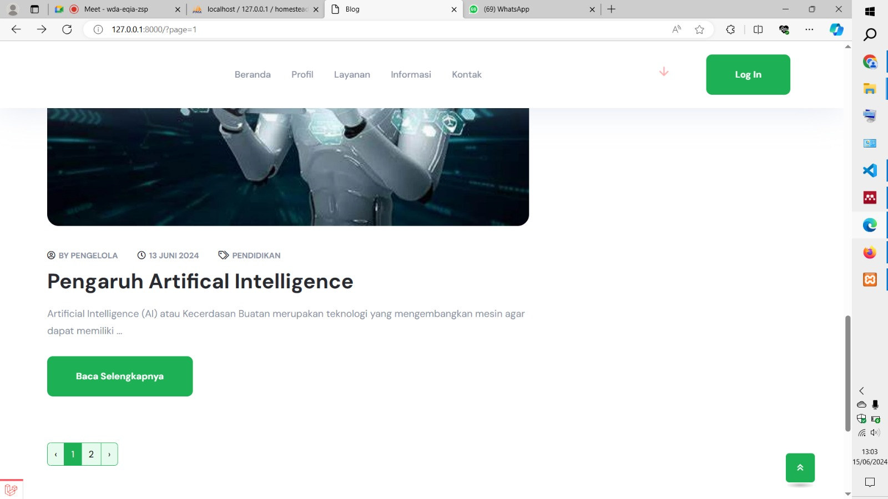
     
## Kategori Berita (Pengelola 1)
  
  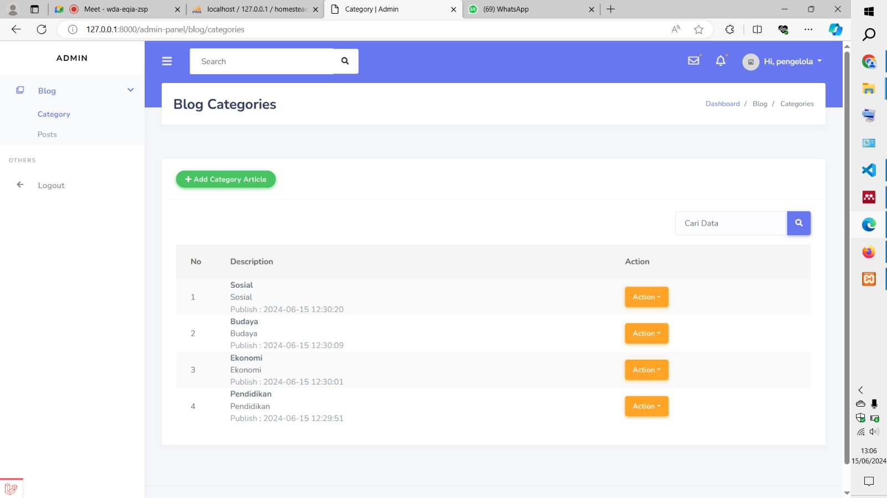

-   Tambah Kategori Berita

    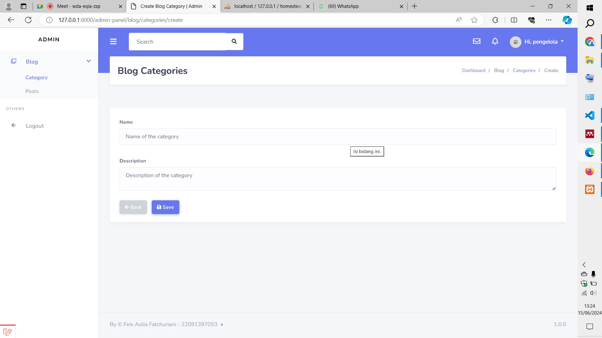

-   Edit Kategori Berita

    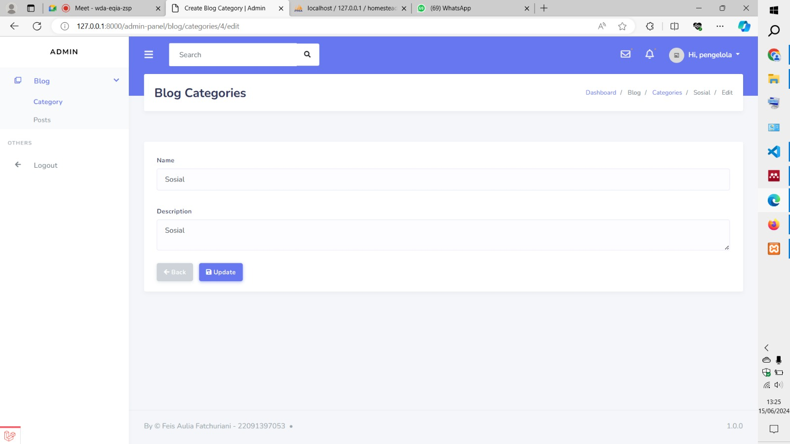

-   Hapus Kategori Berita

    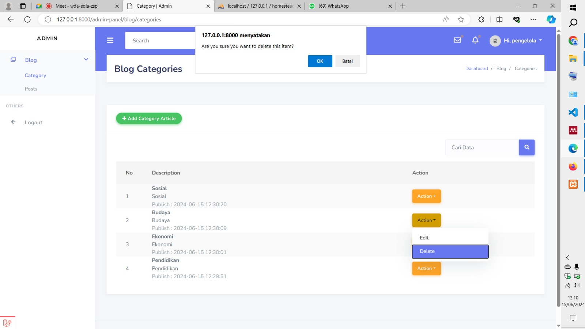

## Post Berita (Pengelola 1)

  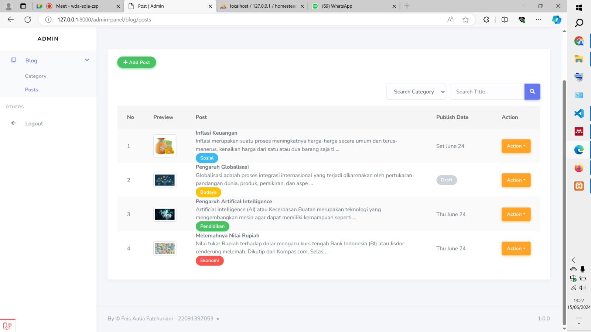

-   Tambah Post Berita

    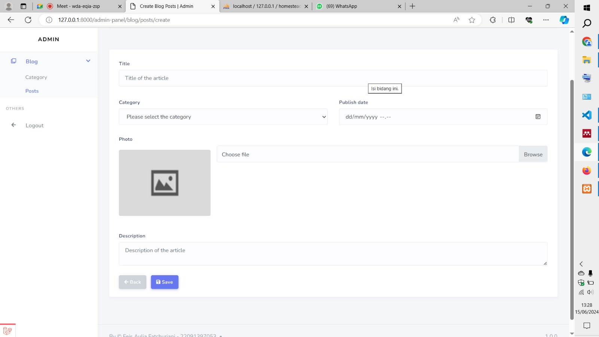

-   Edit Post Berita

    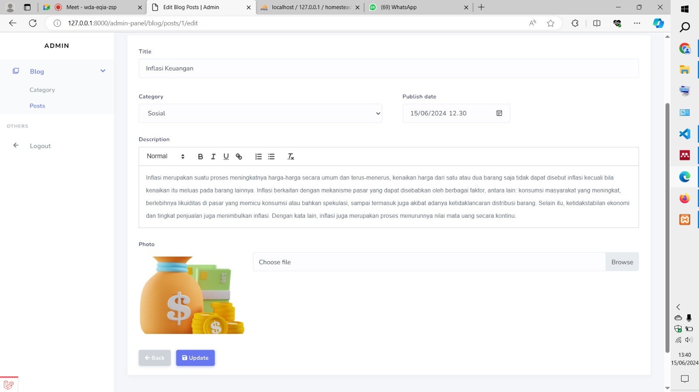

-   Hapus Post Berita

    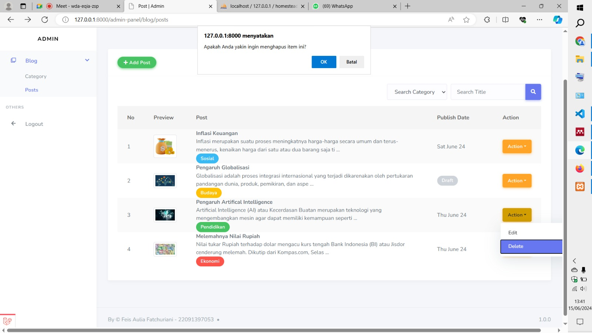

## Post Berita (Pengelola 2)

 Untuk kategori pengelola 2 sama dengan pengelola 1. 

  
  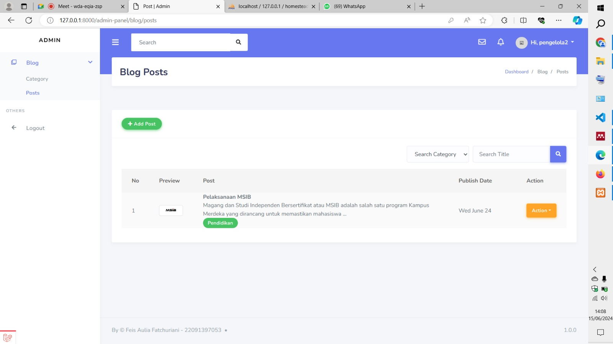

## Post Berita (Admin)

 Admin dapat melihat, mengedit, dan menghapus semua data post dari pengelola 1 dan pengelola 2. 

  
  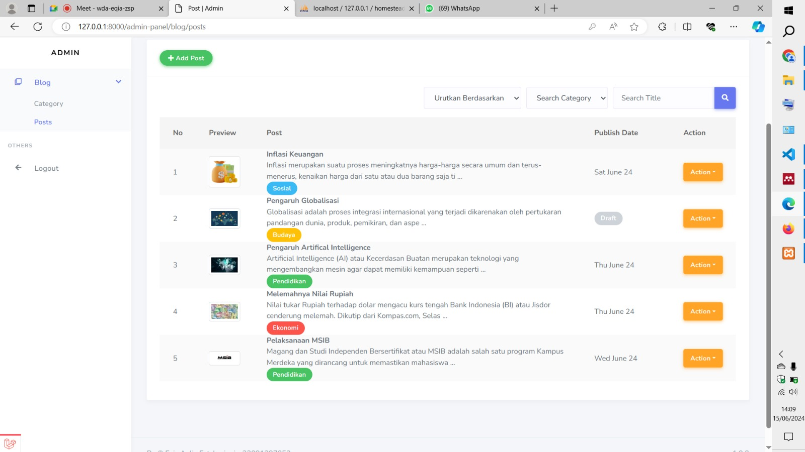

## Logout

 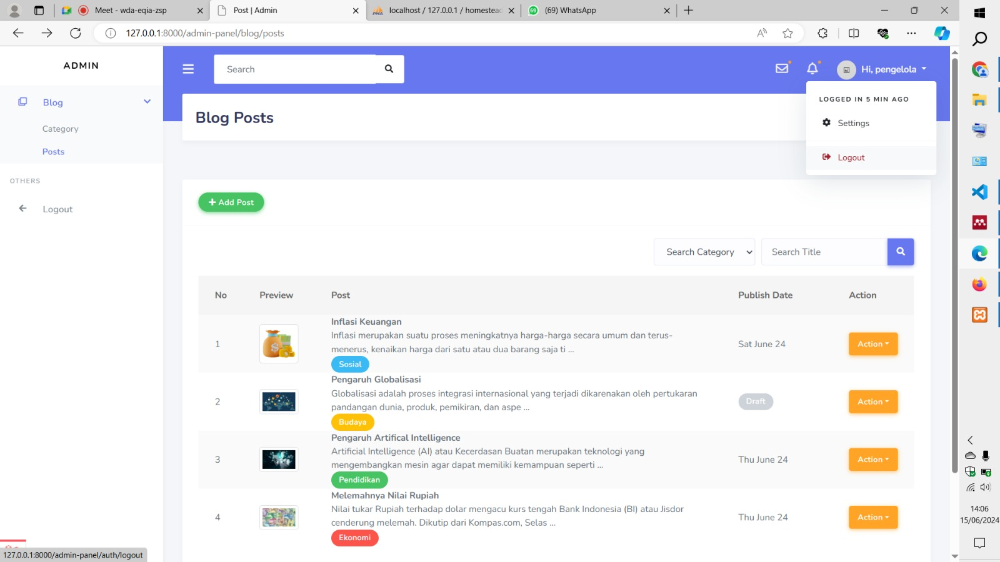
